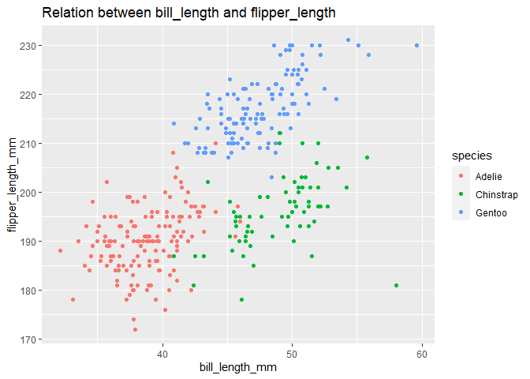

p8105\_hw1\_xy2517
================
Xuehan Yang Uni: xy2517
2021/9/22

All the libraries needed in this project.

``` r
library(tidyverse)
library(palmerpenguins)
```

# Problem 1

Create a dataframe comprised of numeric, logical, character, and factor
variables.

``` r
datatypes_df <-
  tibble(
    num_vec = rnorm(10,0,1), # numeric variable
    logic_vec = num_vec > 0, # logical variable
    char_vec = c("Stephen","Durant","James","Klay","CP3","Davis","Giannis","Joker","Harden","Irving"), # character variable
    factor_vec = factor(c("S","S","A","A","B","A","S","A","S","A"), levels = c("B","A","S")) # factor variables and order them
  )
```

Take the Mean of each variable of the dataframe.

``` r
library(tidyverse)
mean(pull(datatypes_df, 1)) # try the mean for numeric variable
mean(pull(datatypes_df, 2)) # try the mean for logical variable
mean(pull(datatypes_df, 3)) # try the mean for character variable
mean(pull(datatypes_df, 4)) # try the mean for factor variable
```

From the results, I can see that only numeric and logical variables can
be put in the mean() function.

Then convert logical, character and factor variables to numeric.

``` r
as.numeric(pull(datatypes_df,2))
as.numeric(pull(datatypes_df,3))
as.numeric(pull(datatypes_df,4))
```

Conclusions:

Logical and factor variales can be converted to numeric with function
as.numeric, however, character variables can’t.

-   For logical variables, “TRUE” equals to 1 and “FALSE” equals to 0.

-   For character variables, they cannot be converted to numeric.

-   For factor variables, they can be converted to numeric according to
    the alphabetical order by default unless you give them order at the
    beginning.

# Problem 2

After installing packages “palmerpenguins”, load dataset “penguins”.

``` r
data("penguins", package = "palmerpenguins")
```

Then, try to get some descriptive statistics of this dataset.

## Description 1: Names/values of important variables

``` r
names(penguins) 
```

    ## [1] "species"           "island"            "bill_length_mm"   
    ## [4] "bill_depth_mm"     "flipper_length_mm" "body_mass_g"      
    ## [7] "sex"               "year"

``` r
head(penguins,5)
```

    ## # A tibble: 5 x 8
    ##   species island bill_length_mm bill_depth_mm flipper_length_~ body_mass_g sex  
    ##   <fct>   <fct>           <dbl>         <dbl>            <int>       <int> <fct>
    ## 1 Adelie  Torge~           39.1          18.7              181        3750 male 
    ## 2 Adelie  Torge~           39.5          17.4              186        3800 fema~
    ## 3 Adelie  Torge~           40.3          18                195        3250 fema~
    ## 4 Adelie  Torge~           NA            NA                 NA          NA <NA> 
    ## 5 Adelie  Torge~           36.7          19.3              193        3450 fema~
    ## # ... with 1 more variable: year <int>

As we can see, this dataset contains some main characteristics of
penguins like species, body\_mass\_g and body shape indexes. There are 8
columns and 3 factors, 3int and 3 doubles types of data are included.

``` r
summary(penguins)
```

    ##       species          island    bill_length_mm  bill_depth_mm  
    ##  Adelie   :152   Biscoe   :168   Min.   :32.10   Min.   :13.10  
    ##  Chinstrap: 68   Dream    :124   1st Qu.:39.23   1st Qu.:15.60  
    ##  Gentoo   :124   Torgersen: 52   Median :44.45   Median :17.30  
    ##                                  Mean   :43.92   Mean   :17.15  
    ##                                  3rd Qu.:48.50   3rd Qu.:18.70  
    ##                                  Max.   :59.60   Max.   :21.50  
    ##                                  NA's   :2       NA's   :2      
    ##  flipper_length_mm  body_mass_g       sex           year     
    ##  Min.   :172.0     Min.   :2700   female:165   Min.   :2007  
    ##  1st Qu.:190.0     1st Qu.:3550   male  :168   1st Qu.:2007  
    ##  Median :197.0     Median :4050   NA's  : 11   Median :2008  
    ##  Mean   :200.9     Mean   :4202                Mean   :2008  
    ##  3rd Qu.:213.0     3rd Qu.:4750                3rd Qu.:2009  
    ##  Max.   :231.0     Max.   :6300                Max.   :2009  
    ##  NA's   :2         NA's   :2

There are three penguin species and three living islands. The average
bill\_length is 43.92mm, average bill\_depth is 17.15mm, average
flipper\_length is 200.9mm and average body\_mass is 4202g. 165 of them
are female and 168 of them are male.

There are also some NA values in dataset. If we are going to do
statistical inference, data manipulation should be done here.

## Description 2: Size of the dataset

``` r
nrow(penguins)
```

    ## [1] 344

``` r
ncol(penguins)
```

    ## [1] 8

There are 344 rows and 8 columns in this dataset.

## Description 3: Relation between bill\_length and flipper\_length

``` r
ggplot(data = penguins, aes(x = bill_length_mm, y = flipper_length_mm, color = species)) + geom_point() + labs(title = "Relation between bill_length and flipper_length")
```

<!-- -->
